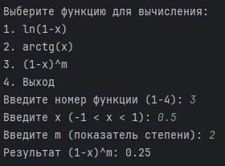

# Проект: Вычисление функций с использованием ряда Маклорена

## Описание проекта
**Цель проекта** – реализация функций для приближённого вычисления значений с использованием **ряда Маклорена**.

В программе реализованы следующие функции:
- *ln(1-x)* – логарифм с помощью ряда Маклорена.
- *arctg(x)* – арктангенс с помощью ряда Маклорена.
- *(1-x)^m* – возведение в степень с использованием ряда Маклорена.

Программа содержит меню для выбора функции и ввода значений.

---

## Возможности
- [x] Вычисление значения **ln(1-x)** с помощью ряда Маклорена
- [x] Вычисление значения **arctg(x)** с помощью ряда Маклорена
- [x] Приближённое вычисление **(1-x)^m**
- [x] Обработка ошибок ввода
- [ ] Улучшение точности за счёт динамического выбора количества итераций

---

## Пример использования

```python
# Вызов функции для ln(1-x)
result_ln = maclaurin_ln1(0.5)
print(result_ln)

# Вызов функции для arctg(x)
result_arctg = maclaurin_arctg(0.5)
print(result_arctg)

# Вызов функции для (1-x)^m
result_power = maclaurin_1(0.5, 2)
print(result_power)
```

**Вывод программы:**
```
Результат ln(1-x): -0.6931471805599453
Результат arctg(x): 0.4636476090008061
Результат (1-x)^m: 0.5625
```

---

## Формулы ряда Маклорена

**Формула для (1-x)^m**:
%5Em%20%3D%201%20-%20%5Cfrac%7Bm%7D%7B1!%7D%5Ccdot%20x%20%2B%20%5Cfrac%7Bm(m-1)%7D%7B2!%7D%5Ccdot%20x%5E2%20-%20%5Cfrac%7Bm(m-1)(m-2)%7D%7B3!%7D%5Ccdot%20x%5E3%20%2B%20...%20%2B%20%5Cfrac%7B(-1)%5En%20m(m-1)...(m-n%2B1)%7D%7Bn!%7D%5Ccdot%20x%5En)

**Формула для ln(1-x)**:
%20%3D%20-x%20-%20%5Cfrac%7Bx%5E2%7D%7B2%7D%20-%20%5Cfrac%7Bx%5E3%7D%7B3%7D%20-%20%5Cfrac%7Bx%5E4%7D%7B4%7D%20-%20...%20-%20%5Cfrac%7Bx%5En%7D%7Bn%7D)

**Формула для arctg(x)**:
%20%3D%20x%20-%20%5Cfrac%7Bx%5E3%7D%7B3%7D%20%2B%20%5Cfrac%7Bx%5E5%7D%7B5%7D%20-%20%5Cfrac%7Bx%5E7%7D%7B7%7D%20%2B%20...%20%2B%20%5Cfrac%7B(-1)%5En%20x%5E%7B2n%2B1%7D%7D%7B2n%2B1%7D)

---

## Установка и запуск

1. Клонируйте репозиторий:
   ```bash
   git clone https://github.com/username/repository.git
   ```
2. Перейдите в директорию проекта:
   ```bash
   cd repository
   ```
3. Запустите программу:
   ```bash
   python filename.py
   ```

---

## Пример работы программы

**Скриншот работы меню программы:**


---

## Требования

- Python 3.x
- Среда разработки (PyCharm, VSCode и т.д.)

---

## Полезные ссылки
- [Документация Python](https://docs.python.org/3/)
- [Ряд Маклорена на Wikipedia](https://ru.wikipedia.org/wiki/%D0%A0%D1%8F%D0%B4_%D0%A2%D0%B5%D0%B9%D0%BB%D0%BE%D1%80%D0%B0)

---

## Авторы
- **Токарев Никита** – *разработка и тестирование*
- **Морозов Егор** – *разработка*

---

## Лицензия

Проект распространяется под лицензией [MIT](https://opensource.org/licenses/MIT).

---

## Обратная связь
Если у вас возникли вопросы или предложения, напишите мне на почту: *minusa050@gmail.com*. 🚀
